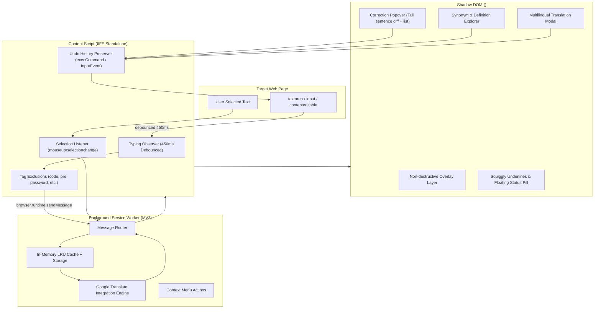

# PolyglotGrammar 🌐✍️

> **Manifest V3 Cross-Browser Extension** for real-time grammar checking as you type, contextual synonym exploration on highlighted words, dictionary definitions, and instant multilingual translation across 130+ languages powered by Google Translate.

[](package.json)
[](https://developer.chrome.com/docs/extensions/mv3/intro/)
[](https://www.google.com/chrome/)
[](https://www.mozilla.org/firefox/)
[](https://www.typescriptlang.org/)
[](https://vitejs.dev/)
[](https://vitest.dev/)
[](LICENSE)

**Created with ❤️ by [sosowaleed](https://github.com/sosowaleed)**

☕ **Support the project:**
[](https://buy.stripe.com/test_8x29AM03GehH2nFbhLfYY01)
[](https://ko-fi.com/sosowaleed)

---

## ✨ Features

- **⚡ Real-Time Grammar & Spell Checking**: Debounces typing events ($450\text{ ms}$) on standard inputs (`<textarea>`, `<input type="text">`, `<input type="search">`) and rich text editors (`[contenteditable="true"]`). Highlights multiple detected grammatical anomalies or spelling typos with inline visual squiggly indicators.
- **🔍 Instant Synonym Explorer & Dictionary Definitions**: Detects double-click or drag-to-highlight text selections, resolves the word against Google Translate's thesaurus (`dt=ss`) and dictionary definitions (`dt=bd` / `dt=md`). **If a word doesn't have any synonyms, PolyglotGrammar automatically displays its dictionary definition and part of speech!**
- **🌐 Dynamic Multilingual UI (l10n Standard)**: Change the entire extension interface language on the fly across the top 10 world languages: **English**, **Spanish (Español)**, **French (Français)**, **German (Deutsch)**, **Italian (Italiano)**, **Portuguese (Português)**, **Russian (Русский)**, **Japanese (日本語)**, **Chinese Simplified (简体中文)**, and **Arabic (العربية, full RTL support)**. Built on an extensible dictionary architecture making it easy to add more languages at any time.
- **🎮 Interactive Dashboard Playground**: Real-time test arena featuring the floating status pill icon that mirrors the in-page extension experience. Test typing live, see error badges pulse, and click the pill to open the proofreader card with one-click full-sentence and individual word replacements.
- **🌍 Full Multilingual Support (130+ Languages)**: Dynamically passes `sl=auto` (auto-detect) across all Google Translate supported languages, automatically adapting suggestions without requiring manual language toggling.
- **🔄 Multilingual Sentence Translation**: Translates highlighted phrases or full sentences with a target language selector, an undo-safe **Replace** button (`document.execCommand('insertText')`), and a **Copy** button.
- **🛡️ Isolated Shadow DOM**: Mounts all tooltips, underlines, badges, and popups inside an isolated Shadow Root container (`<grammar-checker-root>`) with Open mode, preventing any host page CSS collisions or style leakage.
- **⏪ Undo Stack Preservation**: Replaces mistakes while strictly preserving the browser's native `Ctrl+Z` undo/redo history.
- **🔒 Tag & Privacy Safety**: Ignores sensitive inputs (`input[type="password"]`), `code`, `pre`, `script`, `style`, and elements marked with `autocomplete="off"` or `data-gramm="false"`.
- **⚡ In-Memory LRU Cache**: Checks an in-memory LRU cache backed by `chrome.storage.local` before dispatching any network lookup to avoid rate limits and duplicate queries.
- **⚙️ Configurable Behavior**: Independent toggles for "Auto-popup on highlight" (default: off) and "Auto-popup on hover" (default: on), custom ignored domains, and custom ignored words.

---

## 🏛️ Architecture



---

## 🚀 Installation & Development

### Prerequisites
- Node.js 18+ & npm

### 1. Clone & Install
```bash
git clone https://github.com/sosowaleed/polyglot-grammar.git
cd polyglot-grammar
npm install
```

### 2. Build for Chrome & Firefox
```bash
# Build both Chrome and Firefox distributions
npm run build

# Or build individually
npm run build:chrome
npm run build:firefox
```

The output will be generated in `dist/chrome` and `dist/firefox`.

### 3. Package into Distributable Zips
```bash
npm run pack
```
This generates:
- `dist/polyglot-grammar-chrome-v1.0.8.zip` (ready for Chrome Web Store)
- `dist/polyglot-grammar-firefox-v1.0.8.zip` (ready for Firefox Add-ons AMO)

---

## 📦 Loading into Browsers

### Google Chrome / Chromium / Edge / Brave

#### Method 1: Load Unpacked (Development)
1. Open `chrome://extensions/` in your browser.
2. Enable the **Developer mode** toggle in the top-right corner.
3. Click the **Load unpacked** button at the top-left.
4. Select the `dist/chrome` folder in this repository.
5. *Tip:* Refresh any web page tabs that were already open before loading the extension.

#### Method 2: Pack into `.crx`
1. Go to `chrome://extensions/` with **Developer mode** turned on.
2. Click **Pack extension**.
3. Select `dist/chrome` as the extension root directory.
4. Leave the private key blank on first run (Chrome generates a `.pem` key).
5. Click **Pack Extension**. Chrome generates `chrome.crx` and `chrome.pem`.

### Mozilla Firefox

#### Method 1: Load Temporary Add-on
1. Open `about:debugging#/runtime/this-firefox` in Firefox.
2. Click **Load Temporary Add-on...**.
3. Select `dist/firefox/manifest.json`.

#### Method 2: Permanent XPI Installation
1. Run `npm run pack`.
2. In Firefox Developer Edition / Nightly with `xpinstall.signatures.required = false` in `about:config`, drag and drop `dist/polyglot-grammar-firefox-v1.0.8.zip` (or renamed to `.xpi`) directly into Firefox.

---

## 🔄 How Updates Are Handled When Releasing

Releasing and maintaining extensions across Chrome and Firefox follows standard WebExtension distribution lifecycles:

### 1. Chrome Web Store (CWS)
- **Submission**: Upload `dist/polyglot-grammar-chrome-v1.0.8.zip` via the [Chrome Developer Dashboard](https://chrome.google.com/webstore/devconsole).
- **Review**: Automated security scanners and human reviewers verify permissions and code compliance (typically takes between a few hours to 3 business days).
- **Auto-Update Mechanism**: Once approved, Google's update servers automatically push updates to all active users. Chrome checks for updates automatically every few hours (or users can click "Update" in `chrome://extensions/`).
- **Zero Data Loss**: Updates overwrite code files while preserving the user's `chrome.storage.local` settings, stats, and custom ignored words.

### 2. Firefox Add-ons (AMO - addons.mozilla.org)
- **Submission**: Submit `dist/polyglot-grammar-firefox-v1.0.8.zip` to the [Mozilla Add-on Developer Hub](https://addons.mozilla.org/developers/).
- **Review**: AMO automated validator checks the package; manual review applies if sensitive permissions or complex bundles are flagged.
- **Auto-Update Mechanism**: Firefox queries the AMO update manifest every 24 hours. When a new signed version is detected, Firefox silently downloads and applies the update in the background.

### 3. GitHub Releases / Self-Hosted
- For users loading unpacked or installing from GitHub releases, bump the version in `package.json`, `src/manifest.chrome.json`, and `src/manifest.firefox.json` (e.g., `1.0.8` → `1.0.9`).
- Run `npm run build && npm run pack` and attach the output zip files to the GitHub Release.
- Users downloading the updated zip simply replace the folder in developer mode or click "Reload" on the extension card in `chrome://extensions/`.

### 4. Extension Lifecycle Hooks
The service worker uses:
```typescript
chrome.runtime.onInstalled.addListener((details) => {
  if (details.reason === 'install') {
    // First install setup
  } else if (details.reason === 'update') {
    // Migration or what's-new notification
    console.log(`Updated from ${details.previousVersion} to ${chrome.runtime.getManifest().version}`);
  }
});
```

---

## 🧪 Testing

Run the automated test suite powered by Vitest:
```bash
npm test
```

### Running the Interactive Test Harness
Launch the local test server to interact with the demo page and test fixtures:
```bash
node scripts/serve-test.js
```
Then navigate to [http://localhost:5173/](http://localhost:5173/) to test proofreading, synonym discovery, and sentence translation live.

---

## 📁 Project Structure

```
├── .github/workflows/ci.yml       # GitHub Actions CI pipeline
├── public/icons/                  # Extension PNG icons (16px, 48px, 128px)
├── scripts/
│   ├── build.js                   # Universal dual-target build script
│   ├── package-zip.js             # Automated packaging for CWS & AMO
│   └── serve-test.js              # Local test server with API proxy
├── src/
│   ├── background/
│   │   ├── google-translate.ts    # Google Translate query correction, synonyms & definitions
│   │   ├── index.ts               # Manifest V3 service worker & message router
│   │   └── lru-cache.ts           # Fast LRU cache with session storage persistence
│   ├── content/
│   │   ├── correction-popup.ts    # Isolated error popover & suggestion card
│   │   ├── index.ts               # Content script entry & debounced typing observer
│   │   ├── overlay-manager.ts     # Squiggly underline coordinates & floating status badge
│   │   ├── selection-popup.ts     # Floating pill, thesaurus, definitions & translation modal
│   │   ├── shadow-root.ts         # Isolated Shadow DOM container & stylesheet
│   │   ├── tag-filter.ts          # Non-editable tag & safety filtering
│   │   └── text-replacer.ts       # Native undo/redo (Ctrl+Z) text replacement
│   ├── popup/
│   │   ├── index.html             # Dashboard UI with dark glassmorphism
│   │   └── index.ts               # Dashboard settings, l10n, stats & pill playground logic
│   ├── shared/
│   │   ├── l10n.ts                # Dynamic runtime internationalization engine (10 languages)
│   │   ├── languages.ts           # 130+ Google Translate languages registry
│   │   ├── messaging.ts           # Service worker keep-alive & runtime message wrappers
│   │   └── types.ts               # Data contracts & message definitions
│   ├── manifest.chrome.json       # Chrome MV3 manifest (service worker)
│   └── manifest.firefox.json      # Firefox MV3 manifest (background scripts + gecko)
├── test/                          # Unit tests (Vitest)
├── package.json
├── tsconfig.json
├── vite.config.ts
└── vitest.config.ts
```

---

## 💖 Contributing & Donations

If you enjoy using PolyglotGrammar or find it useful, contributions and tips are warmly welcomed:
- **Stripe**: [Tip via Stripe](https://buy.stripe.com/test_8x29AM03GehH2nFbhLfYY01)
- **Ko-fi**: [Support on Ko-fi](https://ko-fi.com/sosowaleed)
- **GitHub**: Star and contribute at [sosowaleed/Grammer-checker-with-google-translate](https://github.com/sosowaleed)

---

## 📄 License

This project is licensed under the [MIT License](LICENSE).
