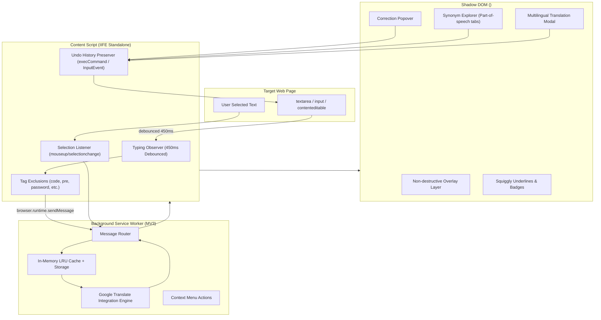

# PolyglotGrammar 🌐✍️

> **Manifest V3 Cross-Browser Extension** for real-time grammar checking as you type, contextual synonym exploration on highlighted words, and instant multilingual translation across 130+ languages powered by Google Translate.

[](https://developer.chrome.com/docs/extensions/mv3/intro/)
[](https://www.google.com/chrome/)
[](https://www.mozilla.org/firefox/)
[](https://www.typescriptlang.org/)
[](https://vitejs.dev/)
[](https://vitest.dev/)
[](LICENSE)

---

## ✨ Features

- **⚡ Real-Time Grammar & Spell Checking**: Debounces typing events ($450\text{ ms}$) on standard inputs (`<textarea>`, `<input type="text">`, `<input type="search">`) and rich text editors (`[contenteditable="true"]`). Highlights detected grammatical anomalies or spelling typos with inline visual squiggly indicators.
- **🔍 Instant Synonym Explorer**: Detects double-click or drag-to-highlight text selections, resolves the word against Google Translate's thesaurus (`dt=ss`) and dictionary definitions (`dt=bd`), and displays a floating popup showing synonyms grouped by Part-of-Speech tags with one-click text replacement.
- **🌍 Full Multilingual Support (130+ Languages)**: Dynamically passes `sl=auto` (auto-detect) across all Google Translate supported languages, automatically adapting suggestions without requiring manual language toggling.
- **🔄 Multilingual Sentence Translation**: Translates highlighted phrases or full sentences with a target language selector, an undo-safe **Replace** button (`document.execCommand('insertText')`), and a **Copy** button.
- **🛡️ Isolated Shadow DOM**: Mounts all tooltips, underlines, badges, and popups inside an isolated Shadow Root container (`<grammar-checker-root>`) with Open mode, preventing any host page CSS collisions or style leakage.
- **⏪ Undo Stack Preservation**: Replaces mistakes while strictly preserving the browser's native `Ctrl+Z` undo/redo history.
- **🔒 Tag & Privacy Safety**: Ignores sensitive inputs (`input[type="password"]`), `code`, `pre`, `script`, `style`, and elements marked with `autocomplete="off"` or `data-gramm="false"`.
- **⚡ In-Memory LRU Cache**: Checks an in-memory LRU cache backed by `chrome.storage.session` / `browser.storage.local` before dispatching any network lookup to avoid rate limits and duplicate queries.
- **🎨 Sleek Dashboard Popup**: Modern glassmorphic interface allowing users to toggle extension status, select preferred fallback languages, manage ignored domains, view real-time statistics, and test phrases in a live playground.

---

## 🏛️ Architecture



---

## 🚀 Installation & Getting Started

### Prerequisites
- Node.js 18+ & npm

### 1. Clone & Install
```bash
git clone https://github.com/your-username/polyglot-grammar.git
cd polyglot-grammar
npm install
```

### 2. Build for Chrome & Firefox
```bash
# Build both Chrome and Firefox distributions
npm run build

# Or build individually
npm run build:chrome
npm run build:firefox
```

The output will be generated in `dist/chrome` and `dist/firefox`.

### 3. Package into Distributable Zips (Optional)
```bash
npm run pack
```
This generates:
- `dist/polyglot-grammar-chrome-v1.1.0.zip` (ready for Chrome Web Store)
- `dist/polyglot-grammar-firefox-v1.1.0.zip` (ready for Firefox Add-ons AMO)

---

## 📦 Loading & Packing into Browsers

### Google Chrome / Chromium / Edge / Brave

#### Method 1: Load Unpacked (Development)
1. Open `chrome://extensions/` in your browser.
2. Enable the **Developer mode** toggle in the top-right corner.
3. Click the **Load unpacked** button at the top-left.
4. Select the `dist/chrome` folder in this repository.
5. *Tip:* Always refresh any web page tabs that were already open before you loaded or reloaded the extension.

#### Method 2: Pack into `.crx`
1. Go to `chrome://extensions/` with **Developer mode** turned on.
2. Click **Pack extension**.
3. Select `dist/chrome` as the extension root directory.
4. Leave the private key blank on first run (Chrome generates a `.pem` key).
5. Click **Pack Extension**. Chrome generates `chrome.crx` and `chrome.pem`.

### Mozilla Firefox

#### Method 1: Load Temporary Add-on
1. Open `about:debugging#/runtime/this-firefox` in Firefox.
2. Click **Load Temporary Add-on...**.
3. Select `dist/firefox/manifest.json`.

#### Method 2: Permanent XPI Installation
1. Run `npm run pack`.
2. Rename `dist/polyglot-grammar-firefox-v1.1.0.zip` to `.xpi`.
3. In Firefox Developer Edition / Nightly with `xpinstall.signatures.required = false` in `about:config`, drag and drop the `.xpi` file directly into Firefox to install permanently.

---

## 🧪 Testing

Run the automated test suite powered by Vitest:
```bash
npm test
```

### Running the Interactive Test Harness
Launch the local test server to interact with the demo page and test fixtures:
```bash
node scripts/serve-test.js
```
Then navigate to [http://localhost:5173/](http://localhost:5173/) to test proofreading, synonym discovery, and sentence translation live.

---

## 📁 Project Structure

```
├── .github/workflows/ci.yml       # GitHub Actions CI pipeline
├── public/icons/                  # Extension PNG icons (16px, 48px, 128px)
├── scripts/
│   ├── build.js                   # Universal dual-target build script
│   ├── generate-icons.js          # Pure Node PNG icon generator
│   └── serve-test.js              # Local test server with API proxy
├── src/
│   ├── assets/                    # Vector assets (SVG)
│   ├── background/
│   │   ├── google-translate.ts    # Google Translate query correction & synonym service
│   │   ├── index.ts               # Manifest V3 service worker & message router
│   │   └── lru-cache.ts           # Fast LRU cache with session storage persistence
│   ├── content/
│   │   ├── correction-popup.ts    # Isolated error popover & suggestion card
│   │   ├── index.ts               # Content script entry & debounced typing observer
│   │   ├── overlay-manager.ts     # Squiggly underline coordinates & status badges
│   │   ├── selection-popup.ts     # Floating pill, thesaurus & translation modal
│   │   ├── shadow-root.ts         # Isolated Shadow DOM container & stylesheet
│   │   ├── tag-filter.ts          # Non-editable tag & safety filtering
│   │   └── text-replacer.ts       # Native undo/redo (Ctrl+Z) text replacement
│   ├── popup/
│   │   ├── index.html             # Dashboard UI with dark glassmorphism
│   │   └── index.ts               # Dashboard settings, stats & playground logic
│   ├── shared/
│   │   ├── languages.ts           # 130+ Google Translate languages registry
│   │   └── types.ts               # Data contracts & message definitions
│   ├── manifest.chrome.json       # Chrome MV3 manifest (service worker)
│   └── manifest.firefox.json      # Firefox MV3 manifest (background scripts + gecko)
├── test/
│   ├── fixtures/demo-page.html    # Interactive browser test page
│   ├── google-translate.test.ts   # HTML query correction parser unit tests
│   ├── languages.test.ts          # Language registry unit tests
│   ├── lru-cache.test.ts          # Cache eviction unit tests
│   ├── tag-filter.test.ts         # Tag filtering unit tests
│   └── text-replacer.test.ts      # Undo-safe text insertion tests
├── package.json
├── tsconfig.json
├── vite.config.ts
└── vitest.config.ts
```

---

## 📄 License

This project is licensed under the [MIT License](LICENSE).
